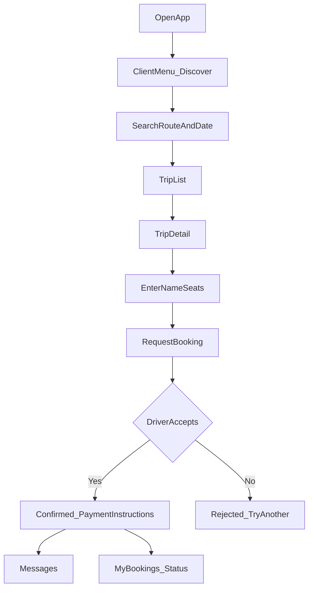
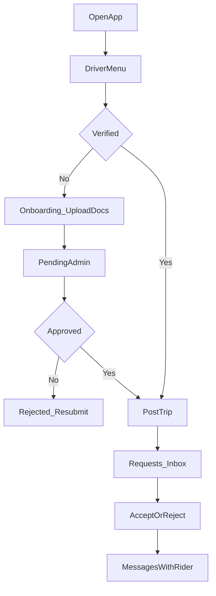

# High-Level UX Flows (P0)

Wireframe order per plan: rider funnel → driver post/requests → verification → support.

## Rider booking funnel

## Driver lifecycle

## Trust and support (surfaces)

- **Verification gate:** block trip post until `driver_profiles.verification_status === approved`.
- **Support:** from booking detail → “Problem with trip?” → ticket id (P0 REST stub acceptable).

## Offline / weak network

- Discover and booking submit: show non-blocking banner; retry button.
- Do not clear form on network error.

## Localization

- P0: English strings in app; Urdu copy deck in `docs/design/COPY_UR.md` (optional follow-up).
